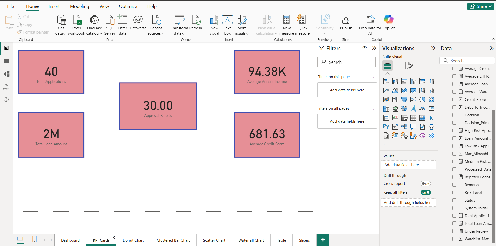
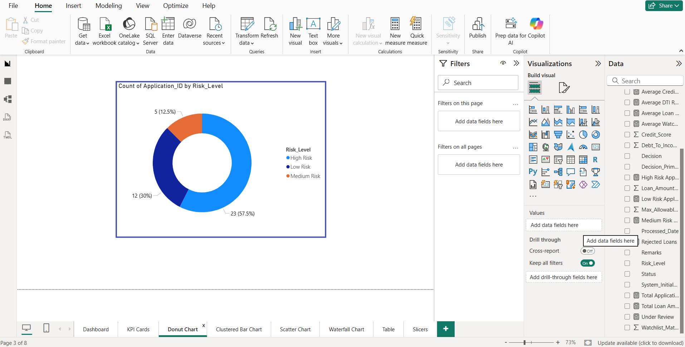
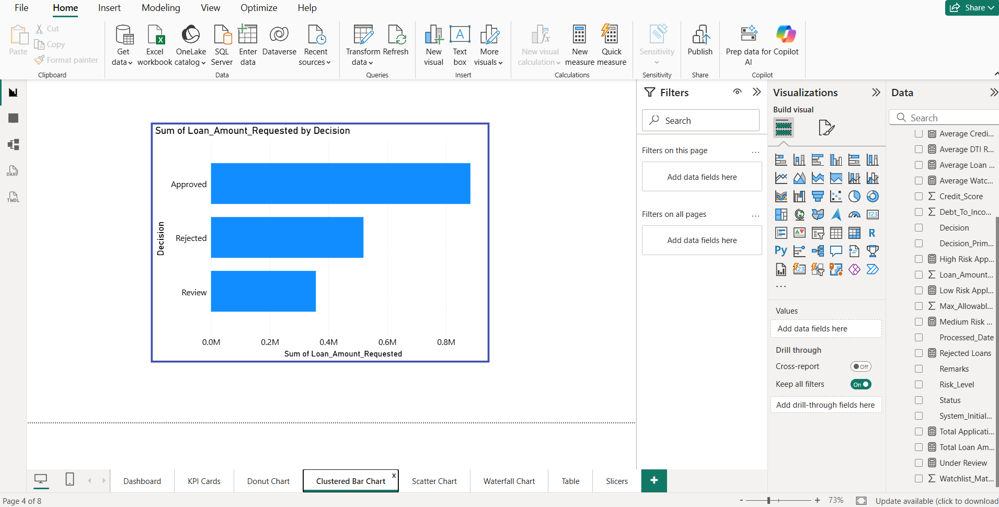
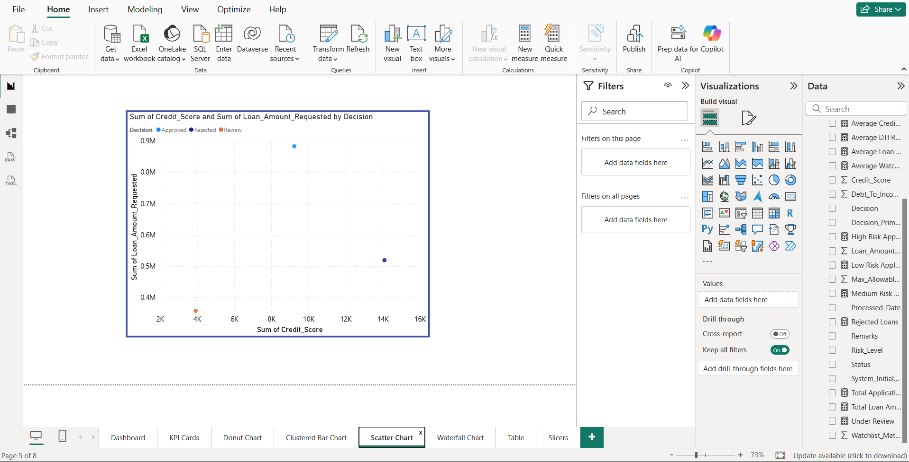
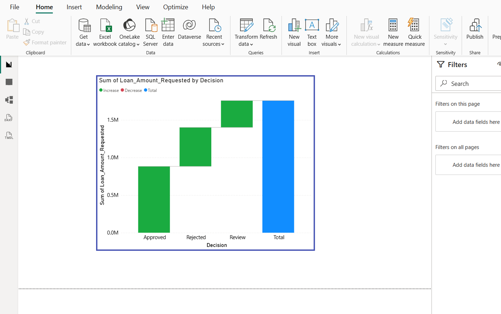

# Loan Approval Dashboard – GitHub README

````markdown
# 📊 Loan Approval Dashboard – Power BI

## 📌 Overview
This Power BI dashboard provides insights into loan approval analysis using applicant financial and risk-related information.  
The dashboard helps analyze:
- Loan approval performance
- Risk segmentation
- Credit score behavior
- Income analysis
- Approval & rejection trends

The project is designed for banking, finance, and lending analytics purposes.

---

# 🚀 Features
- KPI Performance Cards
- Loan Approval Analysis
- Risk Level Segmentation
- Credit Score vs Loan Amount Analysis
- Loan Decision Insights
- Interactive Filters/Slicers
- Applicant Financial Summary Table

---

# 🛠️ Tools & Technologies
- Power BI
- Excel Dataset
- Data Visualization
- Financial Analytics
- Business Intelligence

---

# 📂 Dashboard Visuals

## 1️⃣ KPI Cards
Displays:
- Total Applications
- Total Loan Amount
- Average Annual Income
- Average Credit Score
- Approval Rate %


````


---

## 2️⃣ Donut Chart – Risk Level Distribution

Shows distribution of:

* High Risk
* Medium Risk
* Low Risk Applicants


```

---

## 3️⃣ Bar Chart – Loan Amount by Decision

Represents total requested loan amount based on:

* Approved
* Rejected
* Review


```

---

## 4️⃣ Scatter Chart – Credit Score vs Loan Amount

Analyzes relationship between:

* Credit Score
* Loan Amount Requested
* Loan Decision


```

---

## 5️⃣ Waterfall Chart – Loan Amount Flow by Decision

Displays contribution of:

* Approved Loans
* Rejected Loans
* Review Loans
  towards total loan amount.


```

---

## 6️⃣ Applicant Summary Table

Contains:

* Application ID
* Applicant Name
* Annual Income


```

---

## 7️⃣ Slicers / Filters

Interactive slicers used:

* Status
* Risk Level
* Remarks


```

---

# 📈 Business Insights

* Majority of applicants fall under High Risk category.
* Approval rate is comparatively low at 30%.
* Low income is the major reason for loan rejection.
* Applicants with higher credit scores show better approval chances.
* Approved loans contribute the highest share of loan value.

---

# 💡 Recommendations

* Introduce flexible loan products for low-income applicants.
* Implement AI-based credit risk analysis.
* Improve approval handling for medium-risk applicants.
* Add predictive analytics for default detection.
* Enhance customer retention for rejected applicants.

---

# 🔮 Future Enhancements

* Monthly & yearly trend analysis
* AI-powered forecasting
* Geographic loan analysis
* Branch-wise performance tracking
* Drill-through applicant reports
* Real-time banking analytics integration

---

# 📷 Dashboard Preview


```

---

# 📁 Dataset

The dataset contains:

* Applicant Details
* Credit Scores
* Annual Income
* Loan Amount Requested
* Risk Level
* Loan Decision
* Remarks

---

# 📬 Author

Muskan Garg

```
```
